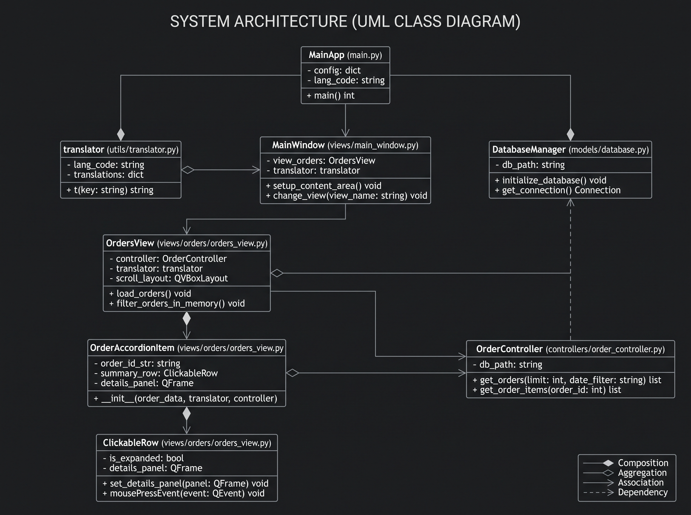
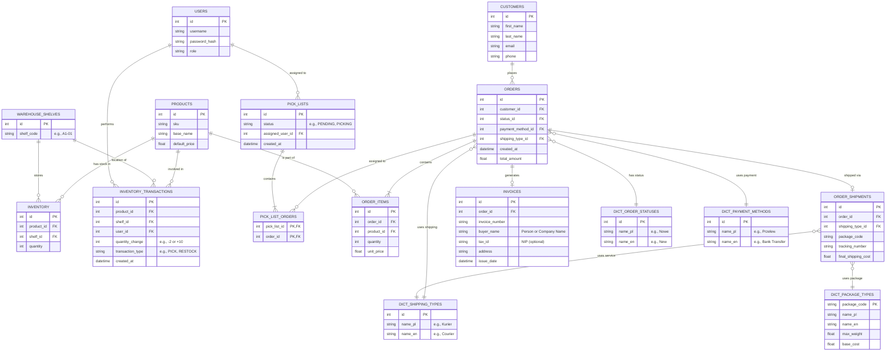

# ERP & Warehouse Management System

## 📌 Project Overview

This application is an ERP system created to monitor incoming orders and assist with warehouse operations and implementations. It provides a comprehensive set of tools to manage inventory, process shipments, and analyze business performance.

The application is built with a focus on usability and supports bilingual interface localization (English and Polish).

## 🚀 Key Features

* **Order Management:** Add, delete, modify, and manage user orders seamlessly.

* **Invoicing:** Generate and manage invoices independently of customer profiles (supporting B2B/company details and separate billing addresses).

* **Data Import:** Built-in tools to import external orders directly into the database.

* **Warehouse Control:** Track inventory levels, product locations (shelves/racks), and pick lists.

* **Analytics & Statistics:** View detailed statistics regarding sales, top products, and overall business performance.

* **Bilingual Support:** Database architecture designed to support multiple languages natively.

## 🛠️ Technology Stack

* **Language:** Python 3

* **GUI Framework:** PySide6 (Qt for Python) - ensuring a fast, responsive, and native desktop experience.

* **Database:** SQLite3 - lightweight, serverless, and robust internal database.

* **Configuration:** JSON - used for local application settings, paths, and user preferences.

## 📸 UI Preview / Screenshots

* **Orders Dashboard:** ``
* **Dark Theme Interface:** ``

📦 WMS-Project
 ┣ 📂 models             # SQLite database manager and models  
 ┣ 📂 utils              # Helpers (e.g., i18n JSON Translator)  
 ┣ 📂 views              # PySide6 UI views (Dashboard, Orders, Products)  
 ┣ 📜 main.py            # Main application router and window  
 ┣ 📜 seed_db.py         # Faker script for generating test data  
 ┣ 📜 config.json        # Local app configuration and styling paths  
 ┗ 📜 translations_*.json # Feature-based language dictionaries

## 🏛️ System Architecture (UML Class Diagram)

The application utilizes a strictly typed, component-based MVC architecture. Below is the UML representation of the core application flow, highlighting the decoupling of PySide6 Views from SQLite Business Logic.

### Architecture Notes:
- **Separation of Concerns:** UI classes (`OrdersView`, `OrderAccordionItem`) never execute SQL. They delegate all data retrieval to the `OrderController`.
- **Dynamic Instantiation:** `OrdersView` acts as a factory, generating multiple `OrderAccordionItem` instances based on the tuple list returned by the controller.
- **Composition (*--) vs Aggregation (o--):** The diagram strictly differentiates between widgets that physically own other widgets (if you delete the View, the Accordions are destroyed) versus references to shared utilities like the `translator` or `OrderController`.

## 🗄️ Database Architecture

Below is the Entity-Relationship Diagram (ERD) mapping the core structure of the system. Dictionary tables (prefixed with `DICT_`) store names in both Polish (`name_pl`) and English (`name_en`) to natively support bilingual interface requirements.

### Database Architecture Notes:

* **Separation of Invoices:** The `INVOICES` table allows billing details (like company name and tax ID) to differ from the original `CUSTOMERS` record, supporting both B2C and B2B transactions.
* **Dictionary Tables (`DICT_`):** These enable seamless switching between languages in the PySide6 UI without hardcoding translations in the backend logic.
* **Granular Inventory:** The `INVENTORY` table acts as a junction, tracking exactly how many units of a specific product are located on a specific warehouse shelf.
